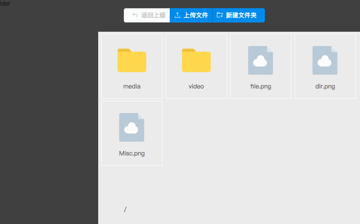

# 对象储存 文件管理器

- 相当于一个私有云盘
- 文件使用 uclound ufile 服务储存
- 采用 python + mongodb 作为后端数据服务
- 采用 react + redux + antd 作为前端界面

## 目前完成:
- 文件上传
- 文件浏览
- 创建目录

## 近期目标:
- 文件信息展示
- 界面体验优化
- 用户认证
- 用户权限管理

## 演示:
